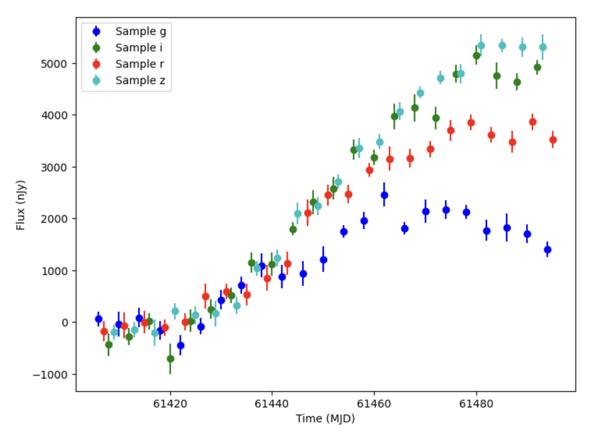

Results and Output
========================================================================================

Results
-------------------------------------------------------------------------------

Results of the simulation are returned in a `nested-pandas <https://github.com/lincc-frameworks/nested-pandas>`_ 
NestedDataFrame. Each row corresponds to a single simulated object with columns for attributes such as 
``ra``, ``dec``, and ``t0`` (if provided). It is important to note that these columns correspond to the
values for the object being simulated (the source). If there are multiple components with different locations
(e.g., host galaxy, lens, etc.), their locations will not be included by default. You can access these columns
as you would with a normal Pandas DataFrame.

.. code-block:: python

    results = simulate_lightcurves(...)
    print("The first result:", results.iloc[0])
    print(f"The first object's location: ({results['ra'].iloc[0]}, {results['dec'].iloc[0]})")

The ``lightcurve`` column stores a nested frame for each object with the corresponding time series information,
including time (MJD), flux, and flux error.  When accessing the light curve at a specific row the result is a
Pandas DataFrame with one row for each observation. Results in the nested light curve DataFrame are sorted by time. If the data is from multiple surveys, this means the data will be interleaved in time order, and the ``survey_idx`` column can be used to identify which survey each observation came from (see below for more details on the columns in the nested light curve DataFrame).

.. code-block:: python

    lightcurve = results["lightcurve"].iloc[0]
    print("The first object's light curve:")
    print(lightcurve)

The key columns in the nested light curve DataFrame are:

    * ``mjd``: The Modified Julian Date of the observation.
    * ``filter``: The filter name for the observation.
    * ``flux``: The observed flux in nJy for the object at that time and filter, including noise. This is what is read out of the sensor.
    * ``fluxerr``: The uncertainty on the observed flux. See the :doc:`noise models <noise_models>` page for more information on how this is computed.
    * ``flux_perfect``: The underlying flux (in nJy) for the object as it reaches the Earth's atmosphere. This represents the object's flux with all effects applied (except atmosphere/sensor noise).

The nested light curve DataFrame also contains book keeping information that can be useful in ad hoc post analysis:

    * ``survey_idx``: The index of the survey from which the observation was drawn (from the list of surveys provided to the simulator). Always 0 if only one survey is provided.
    * ``obs_idx``: The index of the observation in the survey's ``ObsTable``. This allows the user to lookup additional information about the observation from the survey's observation table.
    * ``is_saturated``: A boolean flag indicating whether the observation is saturated.

Note that if the ``output_file_path`` parameter is used, the results are written directly to disk instead of being returned in memory. For details see the `Saving Results` section below.

Saved Simulation State
-------------------------------------------------------------------------------

The results table also contains a copy of the parameters used to simulate each object (in the ``params`` column) as a PyArrow StructArray. This allows users to easily lookup the parameters for a given object and use them for post analysis. The field names in the StructArray consist of the node name and parameter name (separated by a dot):

For example, the parameter ``c`` from the node ``salt2`` would be stored under the field ``salt2.c``.

.. code-block:: python

    salt2_c_value = results["params"].iloc[0]["salt2.c"]

The parameter values will either be scalars or arrays depending on the number of samples generated.

Admittedly, since the parameters are stored in a raw format, they can be difficult to work with.
We provide utility functions to convert these parse through the list and work with them.

Users can rebuild the original ``GraphState`` object from the parameters using the
``GraphState.from_list()`` function:

.. code-block:: python

    state = GraphState.from_list(results["params"].values)

Users can also extract a dictionary of parameters for a specific row (``index``) using:

.. code-block:: python

    results["params"][index]

Or extract all values for a specific parameter across the entire results table using:

.. code-block:: python

    results["params"].struct.field("salt2.c")

Adding Parameters as Columns
--------------------------------------------------------------------------------

If users want to include specific parameters as separate columns in the results table, they can extract a specific parameter and append it as its own column using the ``results_append_param_as_col()`` function in utils/post_process_results. If we want to extract the ``c`` parameter from the node ``salt2``, we can do the following:

.. code-block:: python

    from lightcurvelynx.utils.post_process_results import results_append_param_as_col
    results = results_append_param_as_col(results, "salt2.c")

The new column will be named ``salt2_c`` with an underscore instead of a dot (so the name is not interpreted
as a nested key).

Joining ObsTable Data
--------------------------------------------------------------------------------

Users can include data from the ObsTables' rows in the results by using ``obstable_save_cols`` parameter when starting a simulation. This parameter takes a list of column names from the ObsTable. The values from these columns will be saved in light curve nested table, because there will be one value for each observation (which corresponds to a single row in the ObsTable).

If users have already run a simulation and want to include specific columns from the ObsTable in the results table, they can use the ``results_append_obstable_data()`` function in utils/post_process_results:

.. code-block:: python

    from lightcurvelynx.utils.post_process_results import results_append_obstable_data
    results = results_append_obstable_data(res1, "test_col", [ops_table_1, ops_table_2])

The data will be stored in the ``test_col`` column in the nested light curve DataFrame.

Note that if the simulation was run with mutiple surveys, the function matches observations to each observation based on the ``survey_idx`` and ``obs_idx`` columns in the nested light curve DataFrame.  In this case, users will need to pass in a list of ObsTable in the same order as the original simulation.

Plotting Results
-------------------------------------------------------------------------------

LightCurveLynx includes a variety of plotting functions to visualize the results. For example, the
``plot_lightcurves()`` function can be used to plot the light curve for a single object.

.. code-block:: python

    from lightcurvelynx.utils.plotting import plot_lightcurves
    plot_lightcurves(
        lightcurve["flux"],
        lightcurve["mjd"],
        fluxerrs=lightcurve["fluxerr"],
        filters=lightcurve["filter"],
    )

The function takes arrays for flux and time, as well as optional arrays for flux errors and filters.
The resulting plot will show the light curve with error bars and different colors for each filter.

For example a plot of one of the light curves from the SIMSED.TDE-MOSFIT data set
(`zenodo link <https://zenodo.org/records/2612896>`_) is shown below.

The function also provides the ability to plot the underlying (noise-free) light curve.

Saving Results
-------------------------------------------------------------------------------

After simulating a population of objects, users may want to save the results for later analysis.
LightCurveLynx returns the results as a NestedDataFrame using the
`nested-pandas <https://nested-pandas.readthedocs.io/en/latest/>`__ package.
This allows users to easily save all the results in a single file using the
``to_parquet()`` function.

.. code-block:: python

    results.to_parquet("simulated_lightcurves.parquet")

In addition, each individual light curve is stored as a (nested) Pandas DataFrame. Users can
access and save light curves individually using the standard Pandas functions such as
``to_csv()`` or ``to_parquet()``.

.. code-block:: python

    results["lightcurve"].iloc[0].to_parquet("lightcurve_0.parquet")

Users can also write results directly to disk instead of keeping them in memory by passing a directory path to the ``simulate_lightcurves()`` function using the ``output_file_path`` parameter. Results will be saved as parquet files. Instead of returning a NestedDataFrame, the function will return a list of file paths to the saved results. 

If the simulation is run in parallel, multiple files are created with a _partN suffix, one for each parallel process. See the :doc:`parallel runs <notebooks/parallel_runs>` notebook for an example of this.

Exporting to HATS format
-------------------------------------------------------------------------------

The results can also be exported to the `HATS format <https://github.com/astronomy-commons/hats>`_ 
using the ``write_results_as_hats()`` utility function. HATS data is stored as a set of files in
a directory, so the function takes a directory path as input.

.. code-block:: python

    from lightcurvelynx.utils.io_utils import write_results_as_hats
    write_results_as_hats(dir_path, results, overwrite=True)
